# Anthropic Claude Code 传输协议与架构详解

> 本文档深入解析 Anthropic Claude Code 的内部架构、消息传递机制、MCP 协议集成、以及 Agent 循环的完整通信流程。

## 目录

1. [Claude Code 架构总览](#1-claude-code-架构总览)
2. [Agentic Loop 代理循环](#2-agentic-loop-代理循环)
3. [Claude Code 内部通信协议](#3-claude-code-内部通信协议)
4. [MCP (Model Context Protocol) 传输层](#4-mcp-model-context-protocol-传输层)
5. [工具调用协议](#5-工具调用协议)
6. [会话管理与持久化](#6-会话管理与持久化)
7. [上下文窗口管理](#7-上下文窗口管理)
8. [多环境部署架构](#8-多环境部署架构)
9. [安全与权限控制](#9-安全与权限控制)
10. [扩展机制](#10-扩展机制)

---

## 1. Claude Code 架构总览

### 1.1 整体架构图

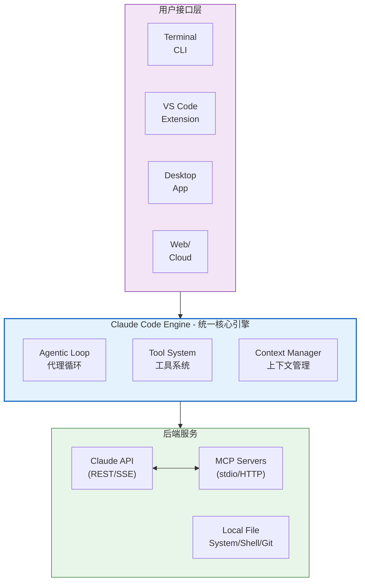

### 1.2 核心组件

| 组件 | 职责 |
|------|------|
| **Claude Code Engine** | 统一核心引擎，所有界面共享相同的底层能力 |
| **Agentic Loop** | 代理循环：收集上下文 → 执行动作 → 验证结果 |
| **Tool System** | 工具系统：文件操作、搜索、执行、Web访问等 |
| **Context Manager** | 上下文窗口管理、压缩、优化 |

### 1.3 可用接口（Interfaces）

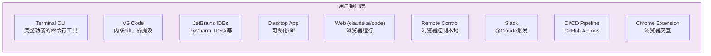

> **重要**: 所有接口共享同一个底层 agentic loop，只是交互方式不同。

---

## 2. Agentic Loop 代理循环

### 2.1 三阶段模型

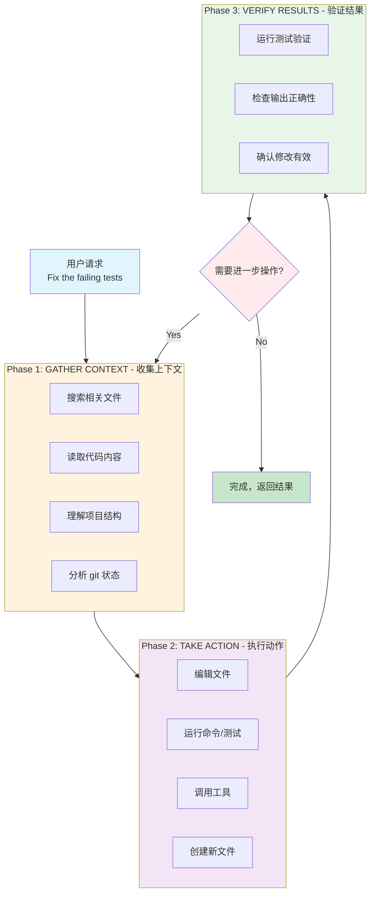

### 2.2 示例："修复失败的测试"

当用户说 "fix the failing tests" 时，Claude Code 的实际流程：

```mermaid
gantt
    title 修复失败的测试 - Agentic Loop 时间线
    dateFormat X
    axisFormat %Ss

    section Phase 1: Context
    收到用户请求           :done, t1, 0, 1
    执行 npm test          :active, t2, 1, 5
    搜索测试文件            :active, t3, 5, 8
    读取测试文件            :active, t4, 8, 12
    读取源代码              :active, t5, 12, 15

    section Phase 2: Action
    编辑 auth.ts             :crit, t6, 15, 18

    section Phase 3: Verify
    运行 npm test 验证      :active, t7, 18, 22

    section 完成
    返回结果               :milestone, t8, 22, 23
```

### 2.3 用户在 Loop 中的角色

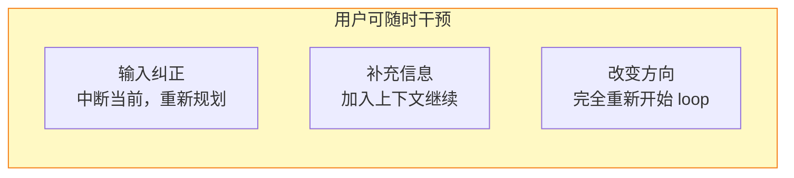

---

## 3. Claude Code 内部通信协议

### 3.1 与 Claude API 的通信

Claude Code 作为客户端与 Anthropic Messages API 通信：

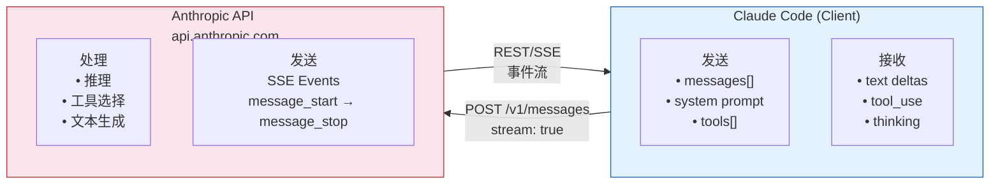

### 3.2 请求构建过程

Claude Code 如何将用户请求转换为 API 调用：

```javascript
// 简化的内部逻辑示意
function buildAPIRequest(userMessage, context) {
  return {
    model: getCurrentModel(),           // claude-opus-4-6 或 claude-sonnet-4
    max_tokens: 16000,
    system: buildSystemPrompt(),        // 包含 CLAUDE.md + 工具定义 + 规则
    messages: [
      ...context.conversationHistory,   // 历史对话
      ...context.toolResults,           // 工具调用的结果
      {
        role: "user",
        content: userMessage            // 当前用户输入
      }
    ],
    tools: [
      // 内置工具定义 (~50+ 个)
      ...builtinTools,
      // MCP 工具（按需加载）
      ...mcpTools,
      // 子Agent工具
      ...subagentTools
    ],
    stream: true,                       // 始终使用流式传输
    thinking: {
      type: "enabled",
      budget_tokens: config.thinkingBudget
    }
  }
}
```

### 3.3 响应处理流程

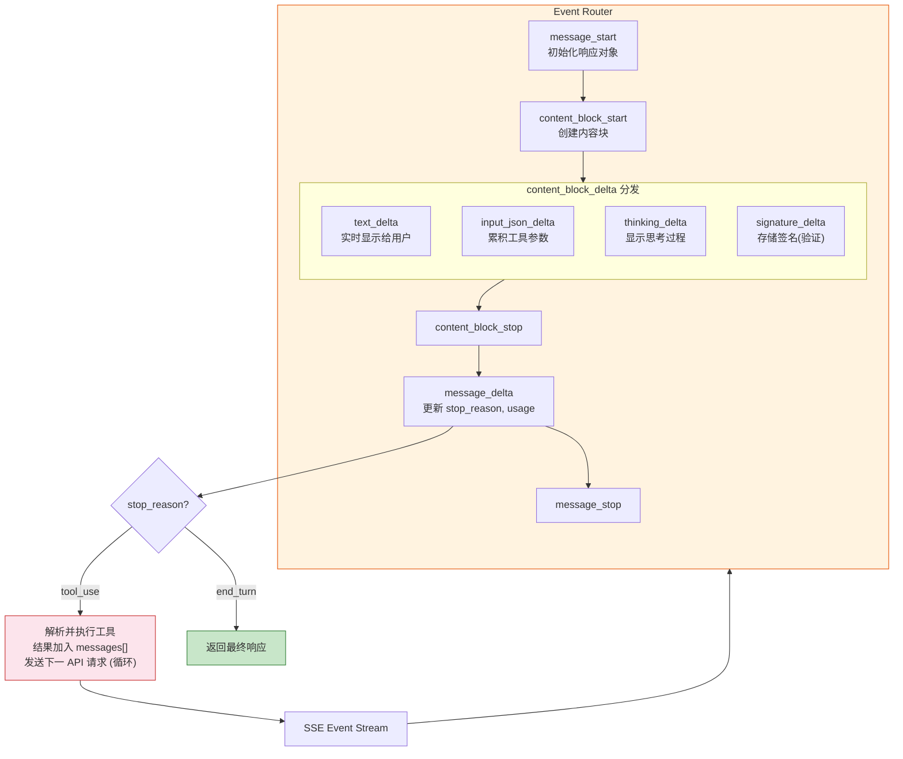

---

## 4. MCP (Model Context Protocol) 传输层

### 4.1 MCP 在 Claude Code 中的角色

MCP (Model Context Protocol) 是 Claude Code 连接外部服务和数据源的开放标准协议。

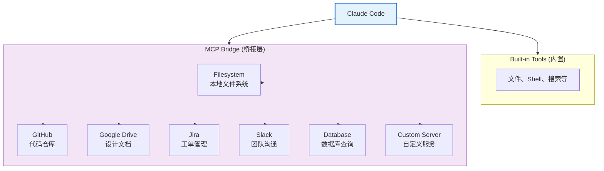

### 4.2 MCP 传输方式

#### 方式一: stdio（标准输入输出）- 推荐

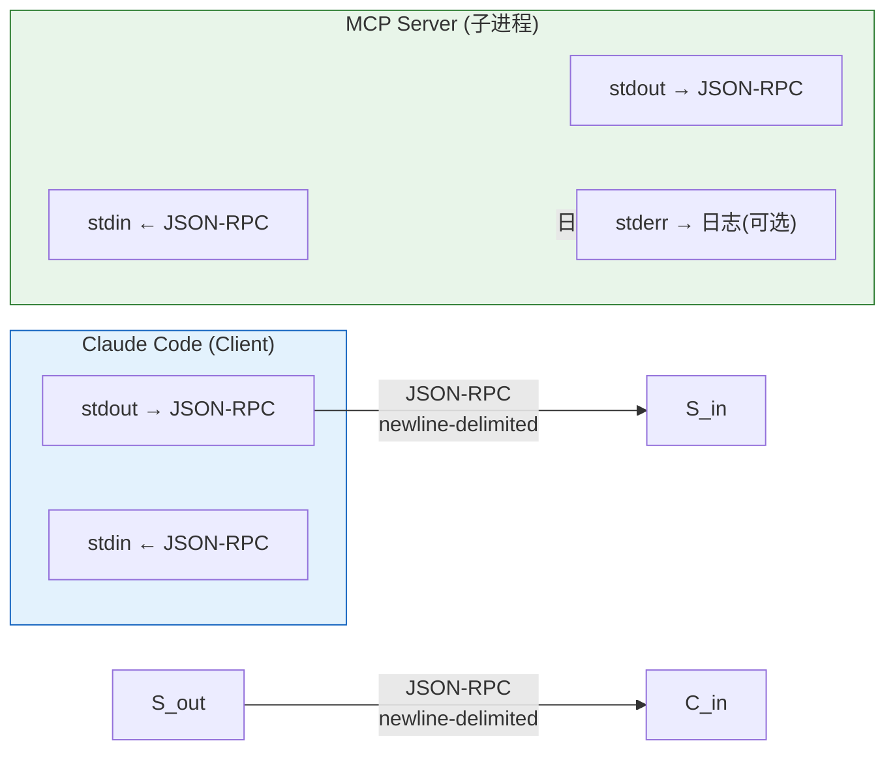

**特点:**
- Client 启动 Server 作为子进程
- 通过标准输入/输出交换 JSON-RPC 消息
- 消息以换行符分隔 (newline-delimited JSON)
- 消息内不能包含嵌入的换行符

**消息格式示例:**
```
{"jsonrpc":"2.0","id":1,"method":"tools/list","params":{}}

{"jsonrpc":"2.0","id":1,"result":{"tools":[...]}}

{"jsonrpc":"2.0","method":"notifications/tools/list_changed"}

{"jsonrpc":"2.0","id":2,"method":"tools/call","params":{"name":"search_files","arguments":{"pattern":"*.ts"}}}

{"jsonrpc":"2.0","id":2,"result":{"content":[{"type":"text","text":"[\"file1.ts\",\"file2.ts\"]"}]}}
```

#### 方式二: Streamable HTTP（可流式HTTP）

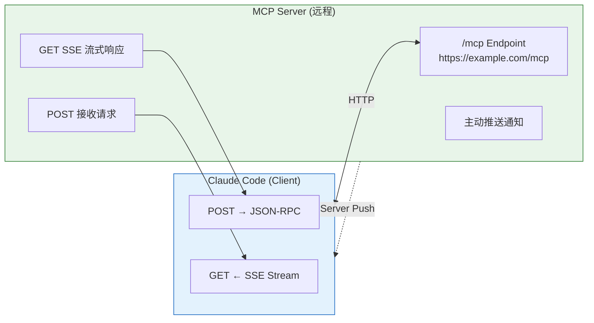

**特点:**
- Server 作为独立进程运行，支持多客户端连接
- 使用 HTTP POST (发送消息) + GET (接收SSE流)
- 支持 Server-Sent Events (SSE) 流式响应
- 支持服务器主动推送通知和请求

**HTTP 请求格式:**

发送消息到服务器：
```http
POST /mcp HTTP/1.1
Host: example.com
Accept: application/json, text/event-stream
Content-Type: application/json
MCP-Protocol-Version: 2025-11-25
MCP-Session-Id: session_xxxxxxxxxx

{"jsonrpc":"2.0","id":1,"method":"tools/list","params":{}}
```

**响应类型:**

对于 JSON-RPC request:
- `Content-Type: text/event-stream` → 开启 SSE 流（推荐）
- `Content-Type: application/json` → 返回单个 JSON 对象

对于 JSON-RPC response/notification:
- 成功接受: `202 Accepted` (无 body)
- 无法接受: `400 Bad Request` (可能包含 error body)

### 4.3 MCP 协议版本

当前版本: **2025-11-25**

版本协商发生在初始化阶段。客户端和服务端可能同时支持多个版本，但必须就单个版本达成一致使用。

### 4.4 会话管理（Streamable HTTP）

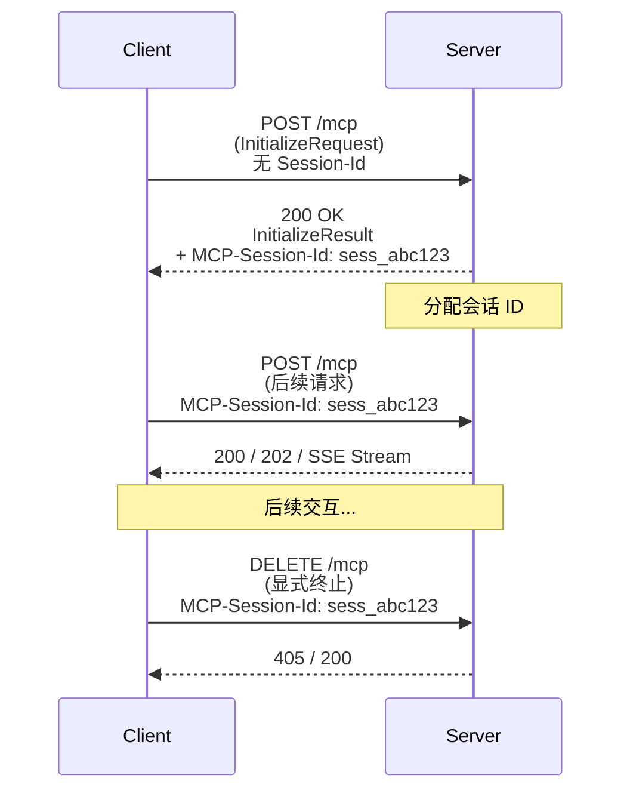

**安全要求:**
- Session ID 应该全局唯一且加密安全（如 UUID, JWT）
- 只能包含可见 ASCII 字符（0x21 - 0x7E）
- 缺少 Session ID 的请求应返回 `400 Bad Request`
- 过期的 Session ID 应返回 `404 Not Found`

### 4.5 断连恢复与消息重投递

```
正常断连恢复流程:

1. Server 为每个 SSE event 分配唯一 ID:
   
   id: evt_001
   data: {"jsonrpc":"2.0","method":"notifications/..."}
   
   id: evt_002
   data: {"jsonrpc":"2.0","method":"notifications/..."}

2. Client 断连后，通过 GET 重连:

   GET /mcp HTTP/1.1
   Last-Event-ID: evt_002    ← 告诉Server最后收到的event
   
3. Server 从 evt_002 之后重放消息

注意事项:
• Event ID 应该编码足够信息来标识来源流
• 重连始终通过 HTTP GET + Last-Event-ID
• 无论原连接是通过 POST 还是 GET 建立
```

### 4.6 安全警告（DNS Rebinding 防护）

```python
# Server 必须实现的检查
def handle_request(request):
    # 1. 验证 Origin header
    origin = request.headers.get("Origin")
    if origin and not is_valid_origin(origin):
        return Response(403, "Forbidden")
    
    # 2. 本地运行时绑定 localhost
    if is_local_deployment():
        bind_address = "127.0.0.1"  # NOT "0.0.0.0"
    
    # 3. 实现适当的身份验证
    if not authenticate(request):
        return Response(401, "Unauthorized")
```

---

## 5. 工具调用协议

### 5.1 内置工具分类

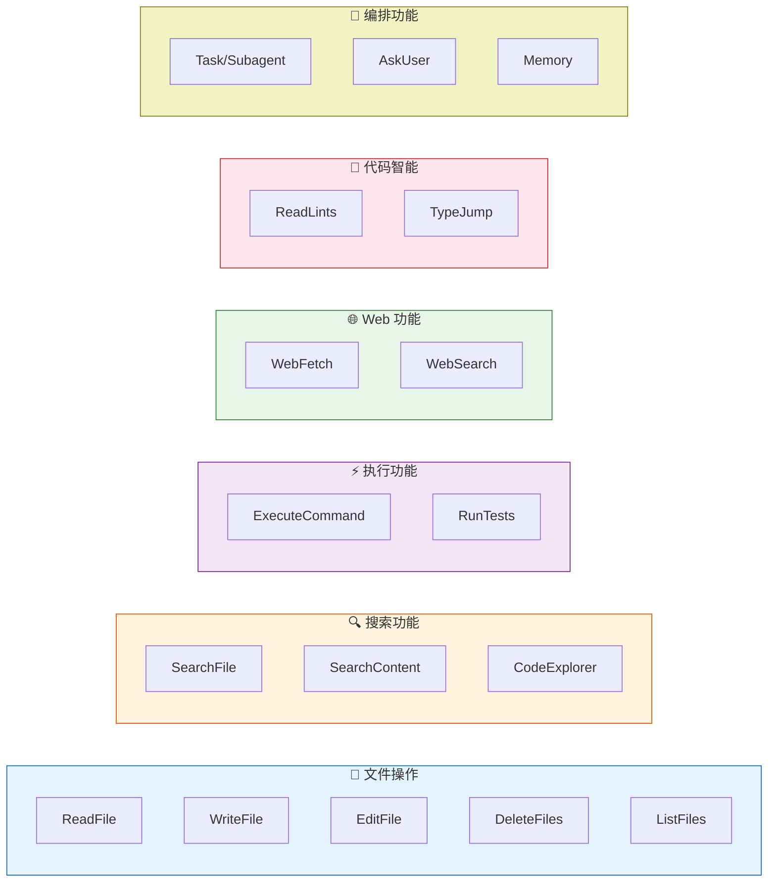

### 5.2 工具调用生命周期

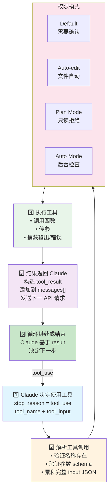

### 5.3 工具调用数据格式

**Claude API 返回的工具调用:**
```json
{
  "type": "content_block_delta",
  "index": 1,
  "delta": {
    "type": "input_json_delta",
    "partial_json": "{\"path\": \"src/main.ts\", \"old_string\": \"const x = 1\", "
  }
}
// ... 多个 delta ...
{
  "type": "content_block_delta",
  "index": 1,
  "delta": {
    "type": "input_json_delta",
    "partial_json": "\"new_string\": \"const x = 42\"}"
  }
}
```

**累积后的完整调用:**
```json
{
  "type": "tool_use",
  "id": "toolu_01ABC123...",
  "name": "replace_in_file",
  "input": {
    "path": "src/main.ts",
    "old_string": "const x = 1",
    "new_string": "const x = 42"
  }
}
```

**工具结果返回给 API:**
```json
{
  "role": "user",
  "content": [
    {
      "type": "tool_result",
      "tool_use_id": "toolu_01ABC123...",
      "content": "Successfully replaced in src/main.ts"
    },
    {
      "type": "text",
      "text": "The file has been updated."
    }
  ]
}
```

---

## 6. 会话管理与持久化

### 6.1 会话存储结构

```
~/.claude/
├── projects/                          # 项目级数据
│   └── e:-PostGraduate-plan-for-all-anthropic/
│       ├── sessions/                  # 会话历史
│       │   ├── session_abc123.jsonl   # 会话记录（JSONL格式）
│       │   ├── session_def456.jsonl
│       │   └── ...
│       ├── checkpoints/               # 文件快照（用于撤销）
│       │   ├── checkpoint_timestamp/
│       │   │   └── path/to/file.ts
│       └── memory.jsonl               # 自动记忆
│
├── settings.json                      # 全局设置
├── credentials.json                   # 认证信息
└── CLAUDE.md                          # 全局指令（可选）
```

### 6.2 JSONL 会话格式

每条记录是一行 JSON，包含完整的消息/工具调用/结果：

```jsonl
{"type":"human","message":{"role":"user","content":"帮我写一个排序函数"}}
{"type":"assistant","message":{"role":"assistant","content":[{"type":"text","text":"好的，我来帮你写..."}],"model":"claude-opus-4-6"}}
{"type":"tool_use","name":"write_file","input":{"path":"sort.ts","content":"function sort(arr)..."}}
{"type":"tool_result","output":"File written successfully"}
{"type":"assistant","message":{"role":"assistant","content":[{"type":"text","text":"已完成！"}]}}
```

### 6.3 会话操作

```
Resume (恢复):
  claude --continue          # 恢复最近会话
  claude --resume session_id # 恢复指定会话
  
Fork (分叉):
  claude --continue --fork-session  # 从当前点创建新分支
  
特点:
• 恢复时加载完整对话历史
• Session-scoped permissions 不继承（需重新批准）
• 同一会话多终端写入会导致消息交错
• 并行工作建议使用 git worktree + fork-session
```

### 6.4 Checkpoint 快照机制

```
每次编辑前:

原始文件: src/app.ts
  ↓ (自动快照)
~/.claude/projects/<path>/checkpoints/<timestamp>/src/app.ts
  ↓ (应用编辑)
编辑后的文件: src/app.ts

撤销操作:
• 按 Esc 两次 → 回退到上一个 checkpoint
• 可以连续回退多次
• Checkpoints 是会话本地的，独立于 Git
```

---

## 7. 上下文窗口管理

### 7.1 上下文组成

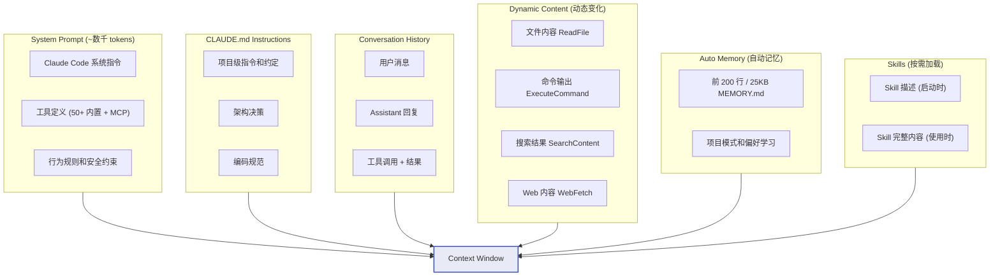

### 7.2 上下文压缩策略

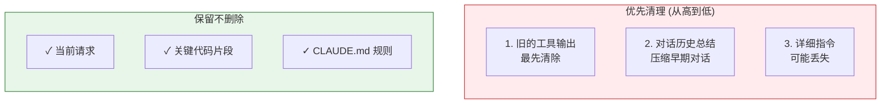

**控制方法:**
- `/context` → 查看上下文使用情况
- `/compact focus on X` → 有针对性的压缩
- 在 CLAUDE.md 中添加 "Compact Instructions" 部分

### 7.3 上下文优化技术

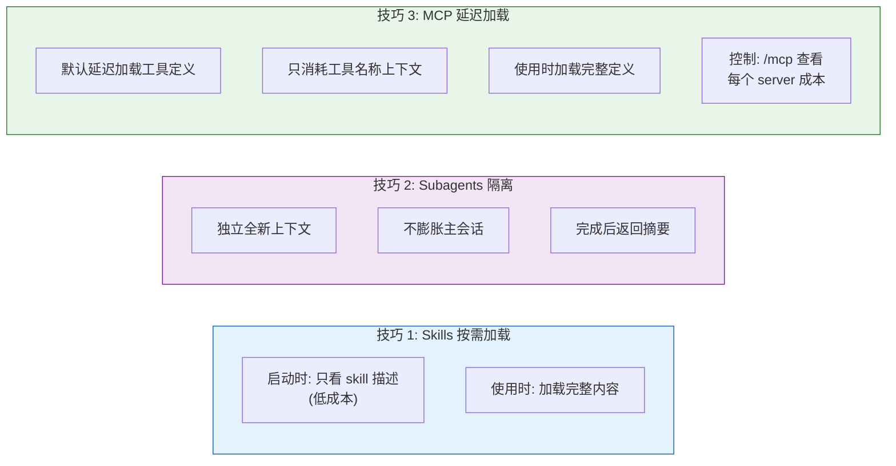

---

## 8. 多环境部署架构

### 8.1 执行环境对比

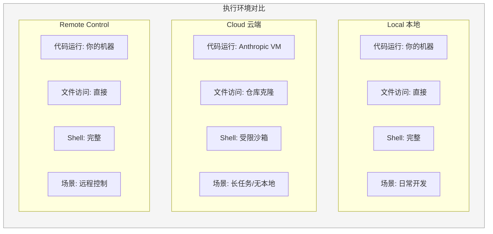

### 8.2 跨平台会话迁移

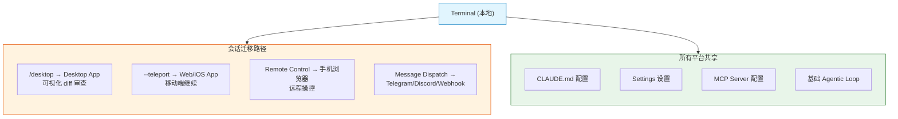

---

## 9. 安全与权限控制

### 9.1 权限模式层级

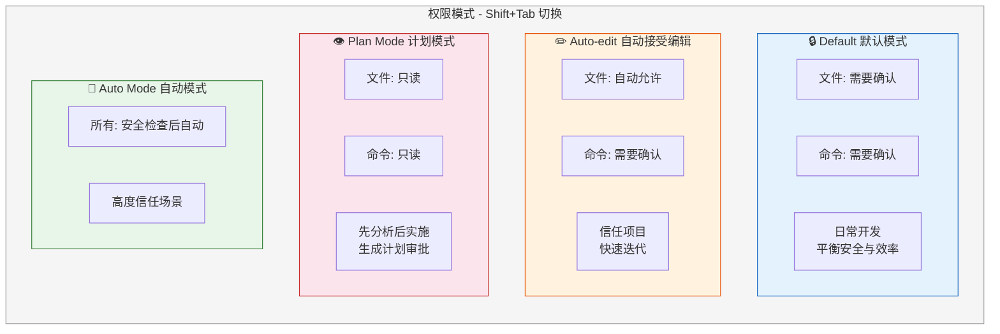

### 9.2 设置层级

```
Organization Policy (组织级)
    ↓ 覆盖
Project .claude/settings.json (项目级)
    ↓ 覆盖
Session Permissions (会话级)
    ↓ 覆盖
User Preferences (个人偏好)

示例 settings.json:
{
  "allowedTools": [
    "npm test",
    "git status",
    "git diff"
  ],
  "permissions": {
    "allow": ["ReadFile", "SearchContent"],
    "deny": ["DeleteFiles"]
  }
}
```

### 9.3 双重安全机制

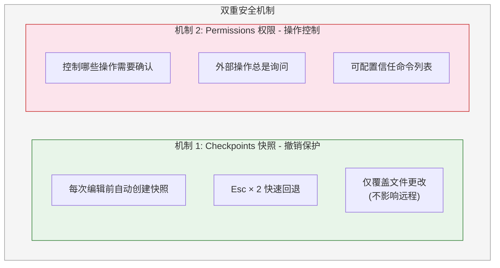

---

## 10. 扩展机制

### 10.1 扩展层次结构

```mermaid
flowchart TB
    subgraph L1 ["Layer 1: Core - 核心"]
        L1A["内置工具"]
        L1B["基本推理能力"]
    end

    subgraph L2 ["Layer 2: Extensions - 扩展"]
        direction LR
        L2A["Skills<br/>可重用工作流"]
        L2B["MCP Servers<br/>外部服务连接"]
        L2C["Hooks<br/>自动化钩子"]
        L2D["Subagents<br/>任务委派/并行"]
    end

    subgraph L3 ["Layer 3: Integration - 集成"]
        direction LR
        L3A["Chrome Extension<br/>浏览器交互"]
        L3B["Slack Bot<br/>团队聊天"]
        L3C["CI/CD<br/>自动化流水线"]
    end

    L1 --> L2 --> L3

    style L1 fill:#e3f2fd,stroke:#1565c0
    style L2 fill:#f3e5f5,stroke:#7b1fa2
    style L3 fill:#e8f5e9,stroke:#2e7d32
```

### 10.2 Skills 技能系统

Skills 是封装的可重用工作流：

```yaml
# 示例: code-review.skill.yaml
name: code-review
description: Review code changes for quality and security

steps:
  - name: analyze-changes
    prompt: "Analyze the recent git diff for potential issues"
    
  - name: check-patterns
    prompt: "Check for anti-patterns and code smells"
    
  - name: security-scan
    prompt: "Look for security vulnerabilities"

triggers:
  - "/review-pr"
  - "/code-review"
```

**技能加载时机:**
- 描述: 启动时就绪（低 token 成本）
- 完整内容: 使用时才加载（按需加载）

### 10.3 Hooks 钩子系统

Hooks 允许在 Claude Code 动作前后执行自定义命令：

```mermaid
flowchart LR
    subgraph Events ["Hooks 事件类型"]
        direction TB
        E1["PreToolUse<br/>工具执行前"]
        E2["PostToolUse<br/>工具执行后"]
        E3["Notification<br/>通知事件"]
        E4["Stop<br/>会话停止时"]
    end

    subgraph Examples ["示例用法"]
        direction TB
        EX1["PreToolUse(WriteFile)<br/>→ 自动格式化代码"]
        EX2["PreToolUse(Commit)<br/>→ 运行 lint 检查"]
        EX3["PostToolUse(EditFile)<br/>→ 运行单元测试"]
    end

    Events --> Examples

    style Events fill:#fff3e0,stroke:#e65100
```

### 10.4 Subagents 子代理系统

子代理是独立的 Claude Code 实例，拥有自己的上下文窗口：

```mermaid
flowchart TD
    Main["主代理 Main Agent<br/>Context: 主对话历史<br/>Task: 重构认证模块"]

    subgraph Subs ["子代理 (独立上下文)"]
        direction LR

        subgraph S1 ["Subagent 1: Code Explorer"]
            S1C["Context: 全新(隔离)"]
            S1T["Task: 探索 auth/ 结构"]
            S1R["Returns: 结构摘要"]
        end

        subgraph S2 ["Subagent 2: Code Writer"]
            S2C["Context: 全新(隔离)"]
            S2T["Task: 重构 login.ts"]
            S2R["Returns: 修改摘要"]
        end

        subgraph S3 ["Subagent 3: Test Writer"]
            S3C["Context: 全新(隔离)"]
            S3T["Task: 写登录模块测试"]
            S3R["Returns: 测试文件"]
        end
    end

    Main --> S1 & S2 & S3
    S1R & S2R & S3R --> Merge["合并结果，返回给用户"]

    style Main fill:#e3f2fd,stroke:#1565c0,stroke-width:2px
    style Subs fill:#f3e5f5,stroke:#7b1fa2
    style Merge fill:#c8e6c9,stroke:#2e7d32
```

**优势:**
- 不膨胀主会话上下文
- 并行处理不同部分
- 每个子代理专注单一任务

---

## 附录 A: Claude Code 与 API 通信序列图

```mermaid
sequenceDiagram
    participant U as 用户
    participant CC as Claude Code
    participant API as Anthropic API

    U->>CC: "修复 auth 模块的 bug"

    Note over CC: 1. 构建系统提示<br/>(工具定义 + CLAUDE.md)

    loop Agentic Loop 循环
        CC->>API: POST /v1/messages<br/>{messages, tools, stream:true}

        API->>API: 推理，决定下一步操作

        alt 需要调用工具
            API-->>CC: SSE Events<br/>message_start → tool_use
            Note over CC: 2. 解析工具调用<br/>3. 执行工具<br/>(ReadFile / EditFile / ...)
            CC->>API: POST (含 tool_result)
        else 完成任务
            API-->>CC: SSE<br/>message_delta (end_turn)<br/>message_stop
        end
    end

    CC-->>U: 显示最终结果给用户
```

---

## 附录 B: 关键配置文件

### B1: CLAUDE.md (项目根目录)

```markdown
# Project Instructions

## Architecture
- Frontend: React + TypeScript
- Backend: Node.js + Express
- Database: PostgreSQL

## Conventions
- Use functional components with hooks
- Follow ESLint rules strictly
- Write tests with Vitest

## Build Commands
- dev: npm run dev
- test: npm run test
- build: npm run build
- lint: npm run lint

## Compact Instructions
When compacting context, preserve:
- Architecture decisions in this file
- Recent changes to core modules
- Any active bug investigations
```

### B2: .claude/settings.json

```json
{
  "permissions": {
    "allow": ["ReadFile", "SearchContent", "ListFiles"],
    "deny": ["DeleteFiles"]
  },
  "allowedTools": [
    "npm run test",
    "npm run lint",
    "git status",
    "git diff"
  ]
}
```

### B3: .claude/commands/ (自定义命令)

```bash
# .claude/commands/review.md
# Usage: /review
Review the current changes. Focus on:
1. Code correctness
2. Security issues
3. Performance concerns
4. Testing coverage
```

---

## 参考资源

- **[How Claude Code Works](https://code.claude.com/docs/en/how-claude-code-works)** - 官方架构文档
- **[Claude Code Overview](https://code.claude.com/docs/en/overview)** - 产品概述
- **[Extend Claude Code](https://code.claude.com/docs/en/extend-claude-code)** - 扩展指南
- **[MCP Specification](https://modelcontextprotocol.io/specification)** - MCP 协议规范
- **[MCP Transports](https://modelcontextprotocol.io/specification/2025-11-25/basic/transports)** - MCP 传输层详情
- **[Permissions Guide](https://code.claude.com/docs/en/permissions)** - 权限控制
- **[Sessions & Checkpoints](https://code.claude.com/docs/en/sessions)** - 会话管理

---

*最后更新: 2026年*
